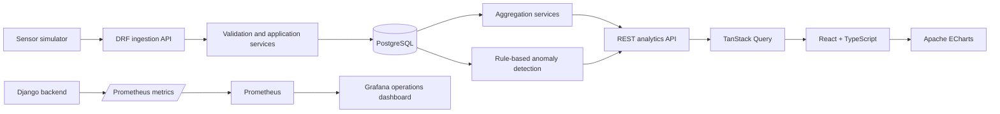

# Water Management, Monitoring & Analytics Platform

A production-style portfolio project demonstrating ingestion, validation, storage, analysis,
visualization, and operational monitoring of **fictional smart-water-meter telemetry**.

This is an independent engineering demonstration. It uses no customer or proprietary data and is
not a production leak-detection system.

## Live portfolio demo

[Open the hosted AquaScope dashboard](https://wongyatwaiwork.github.io/water-monitoring-platform/)

The hosted dashboard runs the production React interface against a clearly labelled, deterministic
synthetic dataset so interviewers can explore every screen without credentials or a long-running
demo server. The complete Django, PostgreSQL, ingestion, monitoring, and Docker Compose stack remains
in this repository and can be run locally with the quick-start command below.

## What is implemented

- Immutable single and bulk sensor-reading ingestion with explicit duplicate handling
- PostgreSQL constraints and indexes for high-frequency device/time data
- Server-side 5-minute, hourly, and daily aggregation
- Daily-consumption and weekday/hour heatmap APIs
- Configurable, transparent continuous-flow and reading-gap detection
- Responsive React dashboard, device fleet, and anomaly views
- ECharts time series with zoom/pan and anomaly intervals, plus bar and heatmap charts
- Prometheus HTTP/domain metrics and a provisioned Grafana operations dashboard
- Health/readiness probes, deterministic fictional seed data, and a sensor simulator
- DRF token authentication for mutations; public read-only demo access
- Backend, frontend, and browser end-to-end tests

## Screenshots

Screenshots are intentionally not committed. The application has been visually verified at desktop
and mobile breakpoints; the hosted dashboard above is the quickest visual reference, while the live
full-stack UI at [http://localhost:3000](http://localhost:3000) is authoritative when running the
complete local environment.

## Architecture



Product analytics and operational monitoring are deliberately separate:

- `Django/PostgreSQL → React → ECharts` presents water-use data to application users.
- `Django → Prometheus → Grafana` reports API and telemetry-pipeline health to operators.

## Technology stack

| Area | Technology |
| --- | --- |
| Backend | Python 3.13, Django 5.2, Django REST Framework, Django ORM |
| Data | PostgreSQL 17; SQLite only for the fast default unit-test profile |
| Frontend | React 19, strict TypeScript, Vite, Material UI, TanStack Query |
| Visualization | Apache ECharts |
| Observability | Prometheus, Grafana |
| Testing | pytest/pytest-django, Vitest/Testing Library, Playwright |
| Delivery | Docker Compose, Gunicorn, Nginx |

Exact JavaScript dependency resolution is recorded in `frontend/package-lock.json`; Python runtime
dependencies are pinned in `backend/requirements.txt`.

## Quick start

Requirements: Docker Desktop or Docker Engine with Compose v2.

```bash
docker compose up --build
```

The first backend start applies migrations and idempotently seeds deterministic fictional data.

| Service | URL |
| --- | --- |
| Product dashboard | http://localhost:3000 |
| API root | http://localhost:8000/api/ |
| OpenAPI / Swagger UI | http://localhost:8000/api/docs/ |
| Health / readiness | http://localhost:8000/api/health/ and `/api/ready/` |
| Prometheus | http://localhost:9090 |
| Grafana | http://localhost:3001 |

Local-only fallback passwords in Compose make the one-command demo possible. For any shared
environment, copy `.env.example` to `.env` and replace every secret/password first. `.env` is not
committed.

```bash
cp .env.example .env
docker compose up --build
```

Grafana allows anonymous Viewer access locally. Its administrator account is only for editing the
demo dashboard and must be overridden outside an isolated workstation.

## Demo data

`python manage.py seed_demo` creates:

- 3 fictional sites
- 7 fictional devices
- 8 days of deterministic 15-minute readings
- one deliberately injected continuous-flow interval
- one offline device and one stale active device

Seed data is clearly synthetic and is generated from a fixed random seed. Restarting the backend
does not duplicate existing telemetry.

## Data flow

1. A simulated device posts one reading or a batch to DRF.
2. A serializer resolves the device serial number and validates required fields, timestamp bounds,
   nonnegative measurements, uniqueness, and cumulative-volume order.
3. A service persists the immutable observation and advances the device's `last_seen_at` value.
4. PostgreSQL remains the source of truth. `(device, timestamp)` is unique and indexed.
5. The detector evaluates explicit continuous-flow and gap rules separately from ingestion views.
6. Analytics services aggregate bounded time ranges in the database.
7. TanStack Query fetches aggregated results; ECharts renders the product views.

See [Data quality decisions](docs/DATA_QUALITY.md) for the complete reject/flag policy.

## API

All `GET` endpoints are public for portfolio review. Creating devices/readings and updating devices
or anomaly status requires a DRF token.

| Method | Endpoint | Purpose |
| --- | --- | --- |
| `POST` | `/api/readings/` | Ingest one reading |
| `POST` | `/api/readings/bulk/` | Ingest 1–1,000 readings with per-item outcomes |
| `GET` | `/api/readings/` | Paginated raw readings with device/site/time filters |
| `GET` | `/api/sites/` | Sites and device counts |
| `GET/POST/PATCH` | `/api/devices/` | Fleet list and authenticated management |
| `GET` | `/api/analytics/summary/` | Dashboard summary cards |
| `GET` | `/api/analytics/usage/` | Bucketed flow and volume (`5m`, `1h`, `1d`) |
| `GET` | `/api/analytics/daily-consumption/` | Daily volume changes |
| `GET` | `/api/analytics/heatmap/` | Weekday/hour average flow |
| `GET/PATCH` | `/api/anomalies/` | Filter anomalies; authenticate status updates |
| `GET` | `/api/schema/` and `/api/docs/` | OpenAPI schema and interactive documentation |

Analytics queries default to a bounded range and reject ranges over 93 days. Raw readings are
paginated. The bulk endpoint is capped at 1,000 records.

### Authenticated ingestion

Set `DEMO_USER_PASSWORD` in `.env`, restart the backend, then obtain a token:

```bash
curl -X POST http://localhost:8000/api/auth/token/ \
  -H "Content-Type: application/json" \
  -d '{"username":"demo","password":"your-configured-password"}'
```

```bash
curl -X POST http://localhost:8000/api/readings/ \
  -H "Authorization: Token YOUR_TOKEN" \
  -H "Content-Type: application/json" \
  -d '{
    "device_id":"WM-001",
    "timestamp":"2026-09-22T08:15:00Z",
    "flow_rate_lpm":3.8,
    "cumulative_volume_l":18240.5,
    "battery_voltage":3.72,
    "signal_strength":-67
  }'
```

Duplicate device/timestamp submissions return HTTP `409` with `duplicate_reading`. Mixed bulk
results return HTTP `207` and retain an accepted/rejected result for every input index.

## Sensor simulator

The standard-library-only simulator supports multiple devices, deterministic output, bulk upload,
historical generation, and optional anomaly injection:

```bash
python scripts/simulate_sensors.py \
  --token YOUR_TOKEN \
  --devices 5 \
  --hours 48 \
  --seed 20260922 \
  --inject-anomalies
```

The target serial numbers (`WM-001` through `WM-007`) must exist. Suspicious or duplicate records
are reported by the API; the simulator does not silently repair them.

## Database design

- `Site.code` and `Device.serial_number` are unique.
- Device status/type use constrained choices; `last_seen_at` cannot precede installation.
- `SensorReading` has database checks for nonnegative flow, volume, and battery values.
- `(device, timestamp)` is both uniquely constrained and indexed.
- Readings are never updated by cleaning logic; raw observations remain immutable.
- Anomaly end times cannot precede start times, and identical device/start/type events are deduplicated.
- Device/site-status and anomaly device/time indexes support fleet and incident queries.

Migrations live beside their Django apps under `backend/*/migrations/`.

## Anomaly detection

The detector is deliberately rule based and explainable. By default it flags:

- continuous flow strictly above `2.0 L/min` for at least 30 minutes;
- gaps between consecutive readings longer than 20 minutes.

Configure these values with `ANOMALY_FLOW_THRESHOLD_LPM`,
`ANOMALY_CONTINUOUS_MINUTES`, and `ANOMALY_MAX_READING_GAP_MINUTES`. Tests cover normal readings,
the exact duration boundary, the strict flow threshold, and long gaps.

These rules demonstrate service boundaries and data-quality behavior. They are not production-grade
leak detection, have not been validated against real hardware, and make no accuracy claim.

## Monitoring

The backend exposes `/metrics` with:

- labeled HTTP request, latency, and error metrics;
- accepted, rejected, and duplicate reading counters;
- anomaly counters by type/severity;
- active and stale device gauges.

Prometheus scrapes the backend every 10 seconds. Grafana automatically provisions the Prometheus
datasource and **Water Telemetry Pipeline Health** dashboard with API rate/latency/errors, ingestion,
rejection, anomaly, and fleet-health panels. Prometheus is not used for product water-use storage.

## Testing and quality checks

### Backend

```bash
python -m venv .venv
# Linux/macOS: . .venv/bin/activate
# Windows: .venv\Scripts\activate
pip install -r backend/requirements-dev.txt
cd backend
pytest
ruff check .
ruff format --check .
python manage.py check
python manage.py spectacular --file schema.yml --validate
```

The fast default test database is SQLite. The live Compose verification applies the same migrations,
seed command, analytics queries, and health checks against PostgreSQL.

### Frontend

```bash
cd frontend
npm ci
npm run lint
npm run test
npm run build
npm run format:check
```

### End to end

Start the Compose stack, install Chromium once, and run:

```bash
cd frontend
npx playwright install chromium
npm run e2e
```

The workflow selects a device, changes the range, checks the flow chart, opens an anomaly, and
navigates back to its device/time context.

## Engineering decisions

- **Django REST Framework:** serializers, ORM/migrations, auth, admin, and schema generation fit a
  coherent modular monolith without introducing separate services.
- **PostgreSQL source of truth:** relational constraints protect telemetry integrity; Prometheus is
  reserved for operational time series.
- **Server-side aggregation:** database buckets keep high-frequency raw datasets out of the browser.
- **TanStack Query, not Redux:** all substantial client state is REST server state.
- **ECharts:** one library supports time-series zoom, bars, heatmaps, and anomaly overlays.
- **Rule-based detection before ML:** behavior is configurable, testable, and honest about scope.
- **Public reads / token-protected writes:** reviewers can explore immediately while state changes
  remain authorized server-side.

## Repository layout

```text
backend/                 Django configuration and domain apps
  fleet/                 Sites and devices
  readings/              Telemetry model, validation, and ingestion
  analytics_app/         Database aggregation and dashboard APIs
  anomalies/             Rules, model, and anomaly API
  monitoring_app/        Metrics middleware and health probes
  tests/                 Backend API and service tests
frontend/                React/Vite application, unit tests, and Playwright workflow
scripts/                 Deterministic sensor simulator
monitoring/              Prometheus and Grafana provisioning
docs/                    Engineering documentation
docker-compose.yml       Five-service local stack
```

## Known limitations

- Simulated sensors only; no hardware protocol or real meter integration
- Fictional data only; no customer or proprietary data
- Rule-based anomaly detection only; no validated leak diagnosis or alert delivery
- Token auth is suitable for a local demonstration, not a complete organization/role model
- No background job queue; detection runs synchronously for this portfolio-scale workload
- Daily volume uses per-device cumulative min/max within each day and does not model meter resets
- Default unit tests use SQLite; PostgreSQL is exercised by the Compose integration path
- No production cloud deployment, backup strategy, TLS termination, or horizontal scaling
- The frontend production bundle favors implementation clarity over aggressive ECharts tree-shaking
